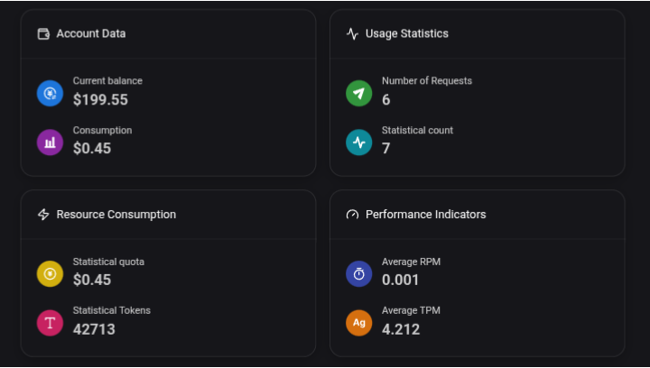
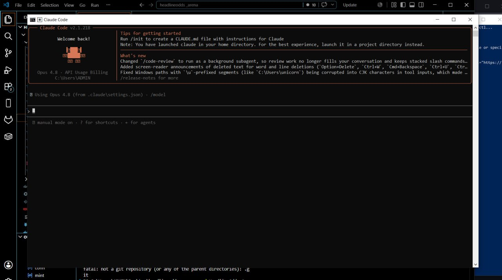

# How to Run Claude Code with Free $200 Credits


A quick guide to using Claude Code with AgentRouter's API.

Claude Code is Anthropic's CLI coding assistant. It can read your codebase, create and modify files, run commands, debug errors, and help you ship faster.

By routing Claude Code through AgentRouter, you can use your available credits across supported models, including:

- Claude Opus 4.8
- Claude Opus 4.7
- Claude Opus 4.6
- GPT-5.5
- QLM-5.2

- ## Claim Your Free Credits

Register on AgentRouter and claim your **$200 in free credits**:

👉 [Register on AgentRouter](https://agentrouter.org/register?aff=9bUg)

> **Important:** You must sign up using a GitHub account that is at least 3 years old and has activity to qualify for the promotional credits.

**No credit card required.**

## 1. Install Claude Code

You need Node.js v18 or higher.

```bash
npm install -g @anthropic-ai/claude-code@latest
```

Verify the installation:

```bash
claude --version
```

## 2. Create the Settings File

### Windows

```bash
notepad %USERPROFILE%\.claude\settings.json
```

### macOS / Linux

```bash
nano ~/.claude/settings.json
```

## 3. Add the Configuration

Paste this into your `settings.json` file:

```json
{
  "model": "opus",
  "env": {
    "ANTHROPIC_BASE_URL": "https://agentrouter.org",
    "ANTHROPIC_AUTH_TOKEN": "YOUR_AGENTROUTER_API_KEY",
    "ANTHROPIC_API_KEY": "",
    "ANTHROPIC_DEFAULT_OPUS_MODEL": "claude-opus-4-8",
    "ANTHROPIC_DEFAULT_SONNET_MODEL": "claude-opus-4-8",
    "ANTHROPIC_DEFAULT_HAIKU_MODEL": "claude-opus-4-8",
    "CLAUDE_CODE_SUBAGENT_MODEL": "claude-opus-4-8"
  }
}
```

Replace:

```text
YOUR_AGENTROUTER_API_KEY
```

with your actual AgentRouter API key.

**Never share your API key or commit it to a public repository.**

## 4. Launch Claude Code

Navigate to your project directory:

```bash
cd your-project-directory
```

Then run:

```bash
claude
```

Inside Claude Code, verify your configuration:

```text
/status
```

If everything is configured correctly, your Claude Code sessions should now be routed through AgentRouter.



## Troubleshooting

If you previously used Claude Code with an official Anthropic account and encounter authentication errors, run:

```text
/logout
```

Then close and restart your terminal before launching Claude Code again.

## Notes

- Promotional credits and eligibility requirements may change.
- Model availability may change over time.
- You can monitor your balance and usage from your AgentRouter dashboard.

Happy building.
